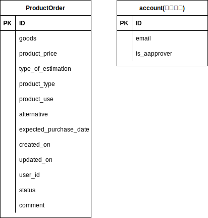

## アプリケーション概要

申請者がお買い物を申請する。承認者が承認したり差し戻したりする。

## ユーザー(申請者)処理

## 承認者処理

## テーブル

## モデル

## ログイン

メールアドレスでログイン。認証は django 任せ。メールアドレス登録時承認者かどうかセットする。登録されたメールアドレスにメールが送付され確認を求める。確認が取れてから使えるようになる。

## ユーザーインターフェース例
