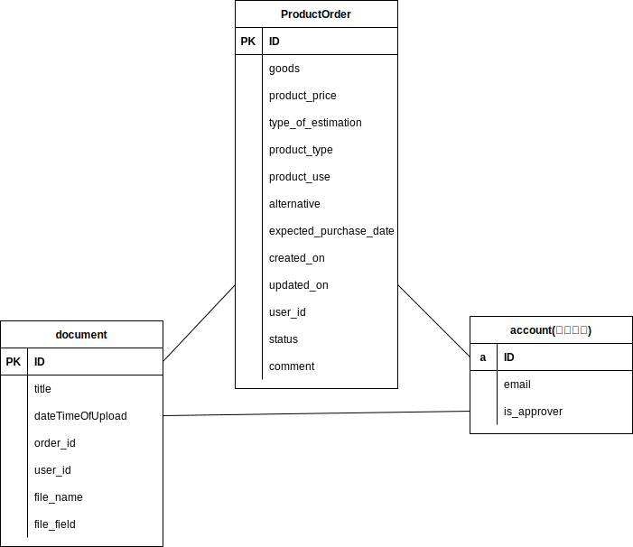
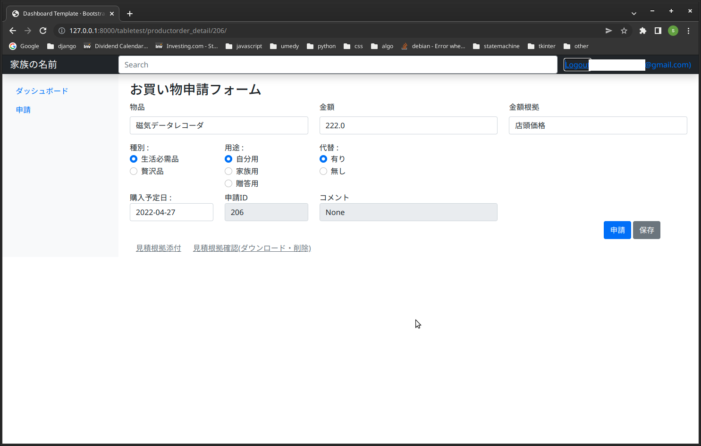

## アプリケーション概要

申請者がお買い物を申請する。承認者が承認したり差し戻したりする。

## ユーザー(申請者)処理

## 承認者処理

## テーブル

## モデル

## ログイン

メールアドレスでログイン。認証は django 任せ。メールアドレス登録時承認者かどうかセットする。登録されたメールアドレスにメールが送付され確認を求める。確認が取れてから使えるようになる。

## ユーザーインターフェース例

### ログイン直後の画面

申請者がログインした直後の画面。

承認者の場合、表示されるのは『申請済み』と『承認済み』のみ。

### 申請画面

承認者用申請画面。申請 ID とコメントは編集できない。申請 ID は新規申請の場合ブランク。保存するか申請すると ID が割り振られ表示されるが編集はできない。コメントを編集できるのは承認者のみ。

一度申請ボタンあるいは保存ボタンを押すと見積根拠を添付できるようになる(ファイルアップロード)。

『見積根拠添付』をクリックするとファイルを添付するためのウィンドウが表示される。

『見積根拠確認(ダウンロード・削除)』をクリックすると添付ファイルをダウンロード、削除するためのウィンドウが表示される。

## その他

django、bootstrap、django-tables2、django-bootstrap-modal-forms を使用。
