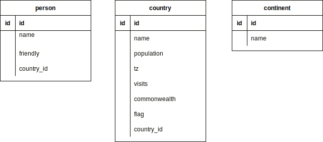

### 


```text
class OrderProduct(models.Model):
    TYPE_CANDIDATE = (
        
    )
    # id(PK) djangoに任せる
    goods = models.CharField(max_length=50, blank=False, null=False)
    price = product_price = models.FloatField() 
    type =
    use = 
    alternative =
    expected_purchase_date = 
    emergency = 
    order_number = 
    created_at = models.DateTimeField(auto_now_add=True)
    updated_at = models.DateTimeField(auto_now=True)
```

  COUNTRY = (
        ('A', 'Japan'),  # (DB値, 読みやすい値)
        ('B', 'America'),
        ('C', 'China'),
    )
    
    country = models.CharField(max_length=1, choices=COUNTRY)


### 表示項目
テーブル1   案件名(linkify) 更新日付　顧客名称　顧客ID　担当者
ボタン 新規案件登録
テーブル2   案件名(linkify) 申請日付　顧客名称　顧客ID　担当者
テーブル3   案件名(linkify) 申請日付　顧客名称　顧客ID　担当者

### モデル
案件名称
更新日付
作成日付
顧客名称
顧客ID
担当者

### login by email
python manage.py startapp accounts
edit settings.py INSTALLED_APPS = ['accounts',]

### exampleのメモ


Bootstrap4 templateでの表示項目
```text
ID   Full name   Country    Continent
```
Personはid,name,friendy, country(fk)

linkifyでリンクになる。

1. urls.py
   path("bootstrap4/", bootstrap4, name="bootstrap4"),
1. views.py
```text
def bootstrap4(request):
    """Demonstrate the use of the bootstrap4 template"""

    create_fake_data()
    table = Bootstrap4Table(Person.objects.all(), order_by="-name")
    RequestConfig(request, paginate={"per_page": 10}).configure(table)

    return render(request, "bootstrap4_template.html", {"table": table})

```
3. "table":table
```text
class Bootstrap4Table(tables.Table):
    country = tables.Column(linkify=True)
    continent = tables.Column(accessor="country__continent", linkify=True)

    class Meta:
        model = Person
        template_name = "django_tables2/bootstrap4.html"
        attrs = {"class": "table table-hover"}
        exclude = ("friendly",)
```
4. templates/bootstrap4_template.html
```html



<!doctype html>
<html>
<head>
    <title>django_tables2 with bootstrap 4 template example</title>
    

</head>
<body>
    <div class="container">
        

        <a href="https://getbootstrap.com/docs/4.0/content/tables/">Bootstrap 4 - tables docs</a> |
        <a href="https://getbootstrap.com/docs/4.0/components/pagination/">Bootstrap 4 - pagination docs</a>

        <h3>django_tables2 with <a href="https://getbootstrap.com/docs/4.0/">Bootstrap 4</a> template example</h3>


        <div class="row">
            
                <div class="col-sm-10">
                    <form action="" method="get" class="form form-inline">
                        
                        
                    </form>
                </div>
            
            <div class="col-sm-10">
                
            </div>
        </div>
        
    </div>
</body>
</html>
```