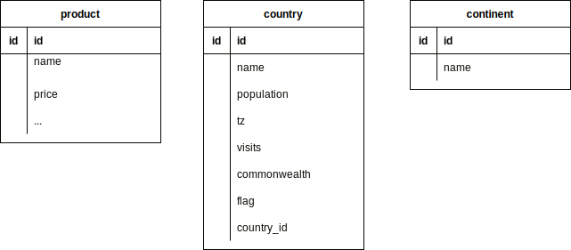

## 
/home/hiroshisakuma/projects/django-tables2/example/templates/index.html
path("", index),
/home/hiroshisakuma/projects/django-tables2/example/app/views.py
同じviews.pyにmultipleあり
    example1 = CountryTable(qs, prefix="1-")
    RequestConfig(request, paginate=False).configure(example1)

    example2 = CountryTable(qs, prefix="2-")
    RequestConfig(request, paginate={"per_page": 2}).configure(example2)

    example3 = ThemedCountryTable(qs, prefix="3-")
    RequestConfig(request, paginate={"per_page": 3}).configure(example3)

    example4 = ThemedCountryTable(qs, prefix="4-")
    RequestConfig(request, paginate={"per_page": 3}).configure(example4)

    example5 = ThemedCountryTable(qs, prefix="5-")
    example5.template = "extended_table.html"
    RequestConfig(request, paginate={"per_page": 3}).configure(example5)

    return render(
        request,
        "multiple.html",
        {
            "example1": example1,
            "example2": example2,
            "example3": example3,
            "example4": example4,
            "example5": example5,
        },
    )


tables.py
    class CountryTable(tables.Table):
        name = tables.Column()
        population = tables.Column()
        tz = tables.Column(verbose_name="time zone")
        visits = tables.Column()
        summary = tables.Column(order_by=("name", "population"))

        class Meta:
            model = Country

    class ThemedCountryTable(CountryTable):
        class Meta:
            attrs = {"class": "paleblue"}


/home/hiroshisakuma/projects/django-tables2/example/templates/multiple.html
    <h3>via template tag</h3>
    <pre> load django_tables2 
     render_table example3 </pre>
    
    

    <h2>Example 4 — QuerySet + pagination + paleblue theme</h2>
    <h3>via <tt>as_html()</tt></h3>
    <pre> example4.as_html </pre>
    {{ example4.as_html }}


### 
/home/hiroshisakuma/projects/django-tables2/example/urls.py
/home/hiroshisakuma/projects/django-tables2/example/app/views.py
                (reverse("bootstrap4"), "template: Bootstrap 4 (bootstrap4.html)"),
/home/hiroshisakuma/projects/django-tables2/example/django-tables2/django_tables2/templates/django_tables2/bootstrap4.html


/home/hiroshisakuma/projects/django-tables2/example/templates/bootstrap4_template.html was used!
/home/hiroshisakuma/projects/django-tables2/example/app/tables.py


### table
    settings.py installed_appsで
        "django_tables2",

    初期ページindex.htmlの中で
        <h2>Basic example of a table</h2>
        

    views.py def index(request)
    これは、初期ページの出だしの部分を設定している
    Basic example of a tableのテーブルは上のrenderでrenderされている
        def index(request):
            create_fake_data()
            table = PersonTable(Person.objects.all())
            RequestConfig(request, paginate={"per_page": 5}).configure(table)

            return render(
                request,
                "index.html",
                {
                    "table": table,
                    "urls": (
                        (reverse("tutorial"), "Tutorial"),
                        (reverse("multiple"), "Multiple tables"),
                        (reverse("filtertableview"), "Filtered tables (with export)"),
                        (reverse("singletableview"), "Using SingleTableMixin"),
                        (reverse("multitableview"), "Using MultiTableMixin"),
                        (reverse("bootstrap"), "template: Bootstrap 3 (bootstrap.html)"),
                        (reverse("bootstrap4"), "template: Bootstrap 4 (bootstrap4.html)"),
                        (reverse("semantic"), "template: Semantic UI (semantic.html)"),
                    ),
                },
            )
    views.py def bootstrap(request)
        def bootstrap(request):
        """Demonstrate the use of the bootstrap template"""

        create_fake_data()
        table = BootstrapTable(Person.objects.all().select_related("country"), order_by="-name")
        RequestConfig(request, paginate={"paginator_class": LazyPaginator, "per_page": 10}).configure(
            table
        )

        return render(request, "bootstrap_template.html", {"table": table})


        Person objectを指定している
        Personはid name friendly country_idの4カラム
        画面に表示されるのも4カラム


        bootstrap.htmlに対しcontext=tableが渡される
        bootstrap.htmlの中では、
        まずヘッダー処理
        その後データ本体を処理
        最後にフッタ-を処理する
        その後、ページネーション処理で
        previous
        1,2,3,4,5
        next
        が設定される
        

```text
class OrderProduct(models.Model):
    PRODUCT_TYPE = (
        ('D', 'Daily'),
        ('L', 'Luxury'),
    )
    PRODUCT_USE = (
        ('F', 'Family'),
        ('M', 'Me'),
        ('G', 'Gift'),
    )
    # id(PK) djangoに任せる
    goods = models.CharField(max_length=50, blank=False, null=False)
    price = product_price = models.FloatField() 
    type_of_estimation = models.CharField(max_length=50, blank=False, null=False)
    type = models.CharField(max_length=1, choices=PRODUCT_TYPE, blank=False, null=False) # daily or luxury
    use =  models.CharField(max_length=1, choices=PRODUCT_USE, blank=False, null=False) # me, family or gift
    alternative = models.BooleanField()

    expected_purchase_date = models.DateTimeField()
    
    order_number = 
    created_on = models.DateTimeField(auto_now_add=True)
    updated_on = models.DateTimeField(auto_now=True)

class
```

  COUNTRY = (
        ('A', 'Japan'),  # (DB値, 読みやすい値)
        ('B', 'America'),
        ('C', 'China'),
    )
    
    country = models.CharField(max_length=1, choices=COUNTRY)


### 表示項目
テーブル1   案件名(linkify) 更新日付　顧客名称　顧客ID　担当者
ボタン 新規案件登録
テーブル2   案件名(linkify) 申請日付　顧客名称　顧客ID　担当者
テーブル3   案件名(linkify) 申請日付　顧客名称　顧客ID　担当者

### モデル
案件名称
更新日付
作成日付
顧客名称
顧客ID
担当者

### login by email
python manage.py startapp accounts
edit settings.py INSTALLED_APPS = ['accounts',]

### exampleのメモ


Bootstrap4 templateでの表示項目
```text
ID   Full name   Country    Continent
```
Personはid,name,friendy, country(fk)

linkifyでリンクになる。

1. urls.py
   path("bootstrap4/", bootstrap4, name="bootstrap4"),
1. views.py
```text
def bootstrap4(request):
    """Demonstrate the use of the bootstrap4 template"""

    create_fake_data()
    table = Bootstrap4Table(Person.objects.all(), order_by="-name")
    RequestConfig(request, paginate={"per_page": 10}).configure(table)

    return render(request, "bootstrap4_template.html", {"table": table})

```
3. "table":table
```text
class Bootstrap4Table(tables.Table):
    country = tables.Column(linkify=True)
    continent = tables.Column(accessor="country__continent", linkify=True)

    class Meta:
        model = Person
        template_name = "django_tables2/bootstrap4.html"
        attrs = {"class": "table table-hover"}
        exclude = ("friendly",)
```
4. templates/bootstrap4_template.html
```html



<!doctype html>
<html>
<head>
    <title>django_tables2 with bootstrap 4 template example</title>
    

</head>
<body>
    <div class="container">
        

        <a href="https://getbootstrap.com/docs/4.0/content/tables/">Bootstrap 4 - tables docs</a> |
        <a href="https://getbootstrap.com/docs/4.0/components/pagination/">Bootstrap 4 - pagination docs</a>

        <h3>django_tables2 with <a href="https://getbootstrap.com/docs/4.0/">Bootstrap 4</a> template example</h3>


        <div class="row">
            
                <div class="col-sm-10">
                    <form action="" method="get" class="form form-inline">
                        
                        
                    </form>
                </div>
            
            <div class="col-sm-10">
                
            </div>
        </div>
        
    </div>
</body>
</html>
```